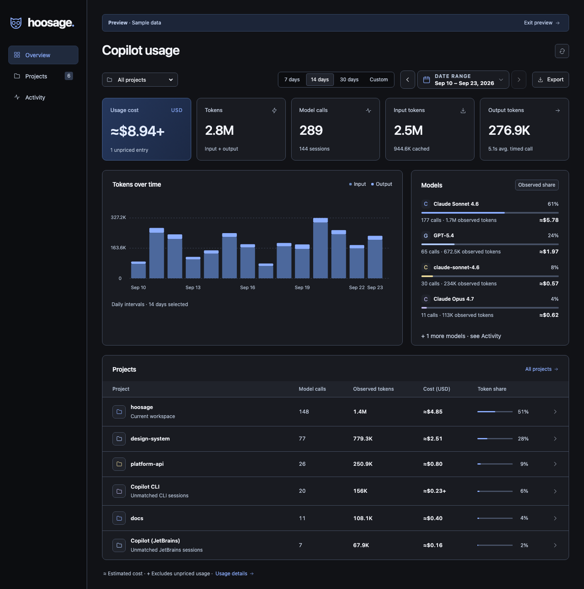
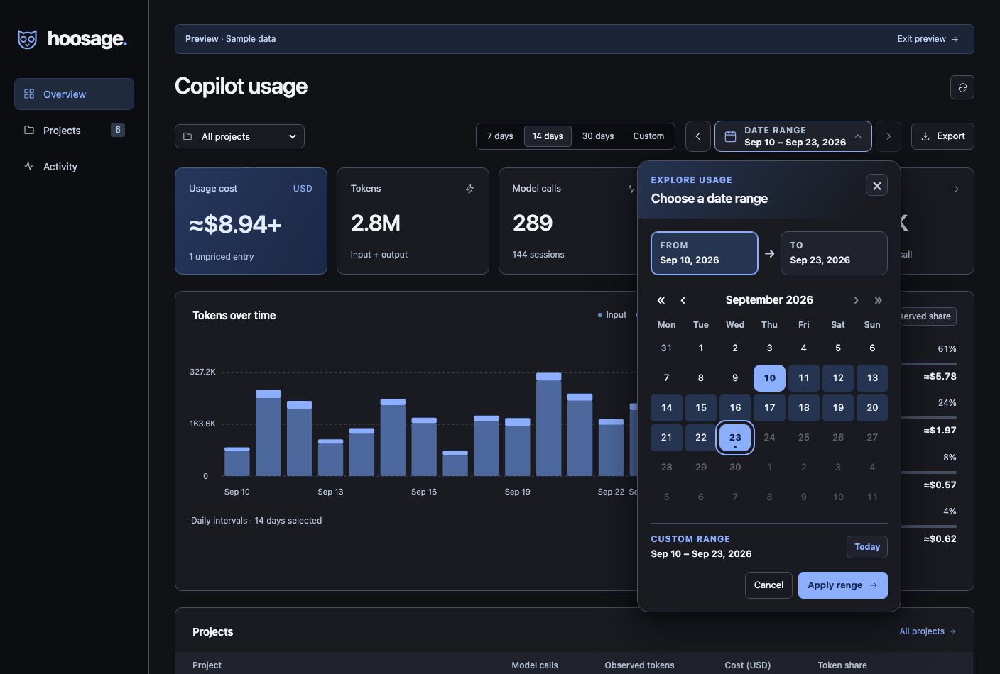
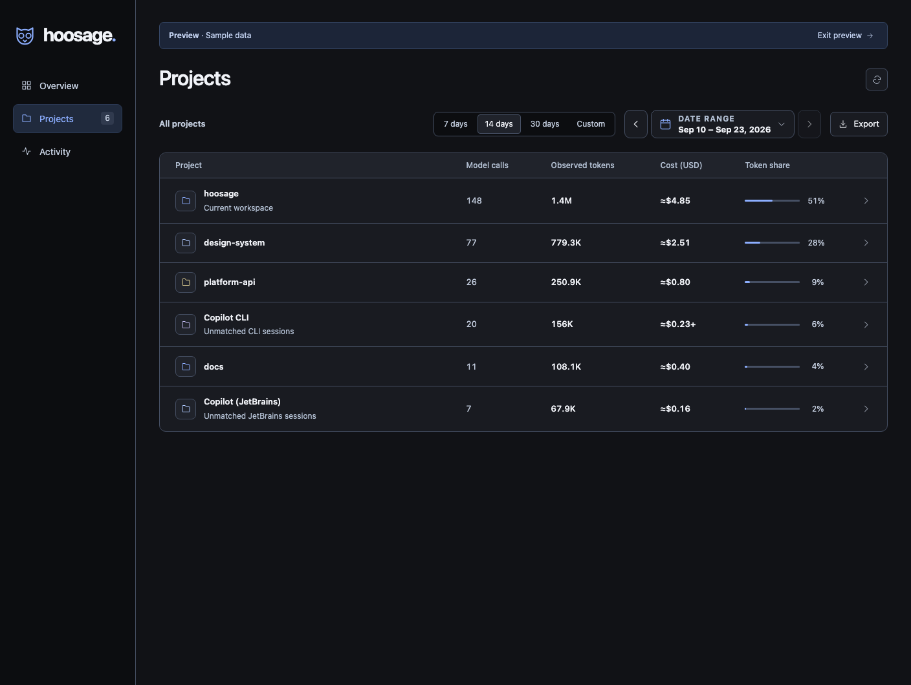
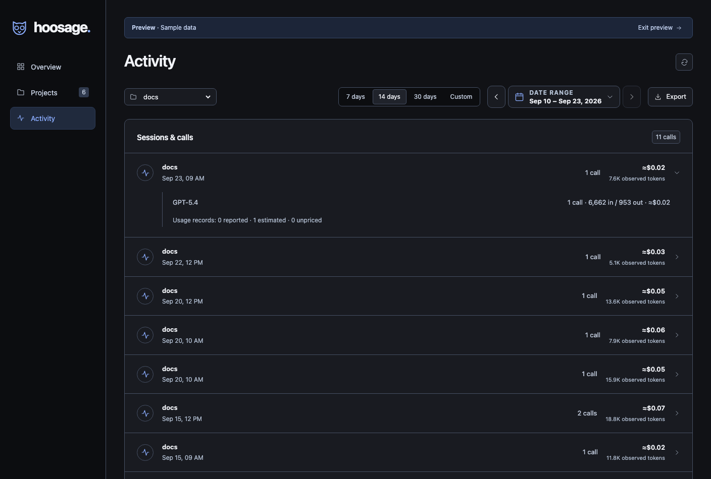
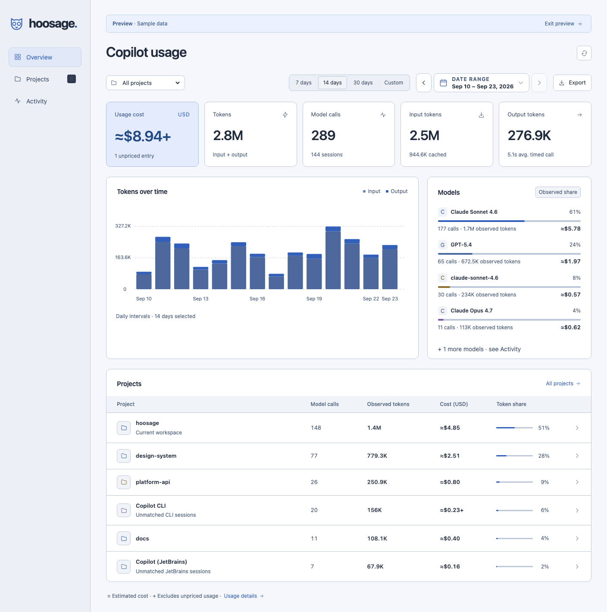

<div align="center">
  
  <h1>hoosage.</h1>
  <p><strong>Copilot usage by project.</strong></p>
  <p>A local Copilot usage dashboard for VS Code, built by OpenHoo.</p>
</div>



_Dark overview. All screenshots show the current dashboard with labelled sample data._

Know where your Copilot usage goes, without leaving your editor. hoosage brings project comparisons, token trends, model breakdowns and session activity into a calm, responsive dashboard and a compact sidebar.

## Install

**JetBrains IDEs:** Download `hoosage-jetbrains-*.zip` from the [GitHub Releases](https://github.com/openhoo/hoosage/releases) page and install it via **Settings → Plugins → Install Plugin from Disk**. The standalone [JetBrains plugin](jetbrains/README.md) provides a hoosage tool window for completed Copilot sessions in the current IDE project.

**VS Code:**

1. Download **hoosage.vsix** from this project's release or CI job artifacts.
2. In VS Code, run **Extensions: Install from VSIX…** and select the file.
3. Open a project, then run **hoosage: Open Dashboard**.
4. Click **Enable Chat tracking once**, reload the window when prompted, and use Copilot Chat. The setting applies to all trusted projects in this VS Code profile. Other already-open windows need one reload after initial setup; newly opened projects register automatically. Previously opened local, single-folder workspaces found in this profile’s saved workspace records appear automatically. Earlier Copilot Chat usage that VS Code still keeps in its local chat transcripts is imported automatically in the background (see [Imported Chat history](#imported-chat-history)).

Requires VS Code **1.119 or newer**, with Copilot's OpenTelemetry settings available. Copilot must already be configured for actual AI use. The extension works in trusted folder workspaces on desktop VS Code, with real Copilot Pro sessions verified on macOS. Remote SSH, WSL and container Chat delivery have not been verified. It does not run in browser-only VS Code or virtual workspaces. In a remote window, install hoosage on the remote workspace host as described below.

Want a look first? **Explore a preview** shows clearly labelled sample data. Samples never enter your usage history or exports.

## What you get

- A dashboard and Activity Bar view with dark, light, high-contrast and narrow layouts.
- Costs in USD for the overview, projects, models, sessions and status bar.
- Observed input/output tokens, model calls, linked sessions and average call duration.
- Usage charts with readable intervals for long periods, model shares and a project comparison table.
- 7-, 14- and 30-day presets, a custom from/to calendar range, project selection and session drilldowns.
- CSV export of the selected project and period, including cost source and price-table date; unknown values stay empty.
- A status bar indicator for today's current-project usage.
- No hoosage account, cloud backend, credentials or outbound analytics.
- Copilot CLI and JetBrains Copilot usage from local session-state files, grouped by working directory.

## Screenshots

### Date range picker

Choose exact start and end dates, jump by month or year, or move the selected period with the toolbar arrows. The calendar works with keyboard navigation and adapts to narrow windows.



### Project costs

Compare each workspace's model calls, tokens and usage cost in US dollars. The **≈** marker identifies estimated costs.



### Session activity

Filter by project and date range, then expand a session to see its model, input/output tokens and cost details.



<details>
<summary><strong>Light theme</strong></summary>

The dashboard follows your VS Code theme, with a light palette alongside the graphite and blue dark theme.



</details>

## What the numbers mean

**These are observed Copilot Chat model calls and CLI session summaries, not a GitHub invoice.** One user prompt can trigger multiple model calls. Agent orchestration totals, logs and cumulative metrics are deliberately excluded from Chat calls because they can repeat the same consumption. Repeated trace/span IDs count once; CLI cumulative metrics are converted to increments between shutdowns.

Cache reads are displayed separately as reported by Copilot; they are **not added again** to input/output totals. Missing token or CLI request counts remain unknown and produce an incomplete-coverage notice. Sessions count only calls with an explicit conversation identifier; each call without one appears separately as an **Unlinked call**.

The extension does **not** report your invoice, remaining monthly allowance, premium requests, inline completion usage, history VS Code has already removed, other machines or GitHub cloud-agent activity. Background agents are included only when their chat spans reach the configured endpoint.

The dashboard offers 7, 14 and 30-day presets plus a **Custom** from/to range. Open the date-range picker to choose the start and end on a calendar; its month and year controls can jump to older history. The previous/next buttons move the whole selected period, stopping at today. The calendar supports arrow keys, Home/End, Page Up/Down (hold Shift to jump a year), Enter and Escape. Long ranges are grouped into legible chart intervals without changing totals. The project list always shows all projects for the selected period. CSV export uses the same period and project selection as the page. Chat calls are assigned to their start date; CLI summaries are assigned to their shutdown date. Chat usage updates after Copilot exports completed spans; CLI usage appears after session shutdown. hoosage polls local history every five seconds.

## Costs in US dollars

When a chat span includes `copilot_chat.copilot_usage_nano_aiu`, hoosage uses that reported per-request value. Nano-AIU / 1,000,000,000 gives AI credits; one AI credit is $0.01. An explicit reported zero is preserved. Session-wide cost attributes are never added to per-request costs.

For Copilot CLI and JetBrains session summaries, hoosage also prefers the reported per-model `totalNanoAiu` increment when consecutive cumulative snapshots permit a reliable difference. Otherwise, **≈** marks an estimate using the [GitHub Copilot model price table](https://docs.github.com/en/copilot/reference/copilot-billing/models-and-pricing), checked **2026-09-23**. The bundled table includes cache-read/write rates and long-context tiers. Cache reads and writes are subsets of OTel input tokens: `(input − reads − writes) × input rate + reads × cache rate + writes × write rate + output × output rate`, divided by one million.

Missing cache details are assumed zero and flagged in cost details. Unknown models, incomplete token counts and inconsistent cache counts remain unpriced. A CLI session aggregate also stays unpriced when its total could cross a per-request long-context threshold. **—** means no amount is available; **+** marks a subtotal that excludes unpriced usage. Expired promotional rates are not used for later calls. Historical calls without reported cost are estimated at the snapshot rates, not historical prices.

USD represents usage value. Subscription fees, included allowances, discounts, taxes and additional charges are not calculated. Prices are bundled with the extension; no pricing service is contacted. The CSV carries the amount, source, assumption or exclusion reason, and estimate table date.

## Project attribution

A VS Code project appears when its workspace is open in a trusted window with hoosage running, when hoosage has registered it in an earlier window, when this profile’s saved workspace records identify a previously opened local single-folder workspace, or when a completed local Copilot CLI or JetBrains session identifies it by working directory. This background scan is best-effort; it skips multi-root workspace files, remote folders, network shares and folders that no longer exist. Discovered folders receive any usage recoverable from VS Code's local chat transcripts (below); projects whose only trace is a transcript — including remote, WSL, multi-root and deleted workspaces — are registered too. Open a folder to collect future Chat usage without another Enable click. A dash in the project table means no saved measurement in the selected period, not a measured zero.

### Imported Chat history

On startup in a local window, hoosage scans this profile's VS Code chat transcripts (`workspaceStorage/<hash>/chatSessions/*.jsonl|*.json` and `globalStorage/emptyWindowChatSessions`) in the background and imports per-request usage it can recover: start time, duration, model, output tokens, Copilot-reported credits (shown as reported cost) and error state. Input tokens are only imported when a request made a single model call, because transcripts only store the last round's prompt size. Older transcripts without token data are imported with unknown tokens and cost. Requests copied between sessions are deduplicated by model message ID. Since transcripts and live OTel spans do not share request IDs, the dashboard counts imported requests only before the first day of live Chat capture for that project. Later imported entries remain stored but are excluded from totals to avoid double counting. Hoosage transiently reads complete transcript files to extract usage, then persists only allowlisted metadata in `projects/<workspace-hash>/chat-history.json`; prompts, responses, tool data and file content are never saved or exported by hoosage. Transcript files larger than 64 MiB are skipped. Chats opened without a folder appear under **Copilot Chat (no folder)**. Chats VS Code has already deleted, and workspaces never opened in this profile, cannot be recovered.
A project is a VS Code folder workspace, identified by a hash of its full workspace URI. All windows share an authenticated local collector. Each extension host registers its `vscode.env.sessionId` against that workspace; incoming OTLP resource `session.id` selects the registered project. Unknown windows are discarded, never assigned to the active editor. Registrations cannot be rebound to another workspace. Identically named folders, clones and worktrees remain separate. A Windows `file://` workspace and a WSL `vscode-remote://` workspace have different identities, even if their folder names match; hoosage shows this distinction in the dashboard and does not merge by name. All registered projects on the same host and profile can be compared.

A saved or multi-root workspace is one **Workspace group**. Copilot's telemetry cannot reliably divide a single request across roots, so hoosage does not invent that precision. Open roots in separate VS Code windows to track them independently.

Copilot CLI sessions are read from `~/.copilot/session-state` (or `$COPILOT_HOME/session-state`) — no setup required. Completed sessions automatically discover projects from their recorded working directory, including projects never opened in VS Code. Sessions launched in a Git subdirectory group under that Git root; sessions under an already registered workspace use its project group. Missing or ambiguous working directories stay in **Copilot CLI**. Sessions created by the GitHub Copilot plugin for JetBrains IDEs (`client_name: copilot-intellij` in `workspace.yaml`) are labelled JetBrains and follow the same discovery rule; unresolved sessions stay under **Copilot (JetBrains)**. Project names and local path hashes are kept on this host; raw paths and repository URLs are not exported.

## Local data and settings

On explicit setup, hoosage changes these **user-level** Copilot settings:

```jsonc
{
  "github.copilot.chat.otel.enabled": true,
  "github.copilot.chat.otel.exporterType": "otlp-http",
  "github.copilot.chat.otel.otlpEndpoint": "http://127.0.0.1:<local-port>/<collector-token>",
  "github.copilot.chat.otel.outfile": "",
  "github.copilot.chat.otel.captureContent": false,
}
```

The listener binds only to `127.0.0.1`. It accepts OTLP JSON/protobuf and gzip, requires a random collector URL token, rejects browser-origin requests and limits request size. Metrics and logs are acknowledged and discarded. Only completed `chat` spans are retained, after an explicit allowlist removes prompts, responses, code, tool arguments, repository URLs and other attributes.

History lives under `globalStorageUri/projects/<workspace-hash>/`; shared collector configuration and hashed window registrations live alongside `projects/`, outside your repository. Opening the same workspace after an update retains the project record and appends to the existing usage file. Each VS Code profile and extension host has separate storage; opening a remote workspace or a different profile does not migrate local history. If a previously registered project has lost its Chat history file on this host, hoosage reports that condition instead of silently creating an empty replacement. **hoosage: Diagnose Tracking** reports the current project's opaque directory ID and workspace-derived name, a fingerprint of this extension storage location, file size and modification time, bytes and lines read, separate Chat and CLI indexing states, endpoint match and collector health. It omits the raw storage path, endpoint, token and usage content. The project name lets you confirm you are diagnosing the intended window when several projects are open across windows.

Saved usage is indexed in the background when the extension starts. The dashboard and status bar show an indexing state until totals are complete; large local histories are read in bounded batches without delaying extension activation.

VS Code 1.138 restricts these Copilot settings to application scope. Setup therefore uses user settings, without writing secrets into project files. When the configured Hoosage endpoint and `collector.json` differ, startup rebinds the configured local endpoint; foreign destinations are never adopted. Local desktop VS Code is verified; separate profiles and remote hosts must not share another host's endpoint. Telemetry environment overrides and enterprise policy conflicts are reported instead of silently redirecting them. VS Code's global telemetry-off preference is respected; it also disables Copilot's local OTel exporter upstream.

### WSL and Dev Containers

VS Code can run extensions on the local UI host or the [remote workspace host](https://code.visualstudio.com/api/advanced-topics/remote-extensions). In a WSL or Dev Container window, install hoosage **in that remote environment** and reload. If only the local copy is present, hoosage displays an actionable blocked state and **Diagnose Tracking** explains which host is running. A reachable collector on a remote host alone does not prove that Copilot Chat sends spans to that host: make one real Chat request and check whether the saved Chat-entry count increases. If it does not, remote Chat delivery is not yet supported for that host arrangement; use a local workspace for verified tracking. Hoosage never copies usage between local, WSL and container storage automatically.

**Stop tracking before uninstalling.** Run **hoosage: Stop Tracking** and reload all open windows to restore the previous user values. This stops collection for all projects in this VS Code configuration. Settings changed by you after setup are preserved. Stopping keeps your history. To delete history, stop tracking, reload, and delete the corresponding project directory from hoosage global storage. No automatic retention/rotation is performed in this first release; the sanitized JSONL file grows with usage.

All registered windows share the collector; a remaining window can take over if its owner closes. Copilot calls made during a handover may be missed. Loopback transport is not protection against other processes already running as your OS user.

## Development

Node.js 22+ and npm:

```sh
npm ci
npm run check       # TypeScript, ingestion/analytics tests, production build
npm run preview     # Sample-data UI at http://127.0.0.1:4173
npm run package     # hoosage.vsix
```

Press **F5** to launch an Extension Development Host. The production bundle contains no framework runtime or external assets. The only runtime dependency is the bundled protobuf decoder.

`npm run test:extension` runs an isolated VS Code smoke test. It uses a separate profile and a synthetic OTLP producer; no account credentials or billable model calls are required. Set `VSCODE_EXECUTABLE` to use an existing VS Code binary. If Copilot is not automatically registered in the test profile, set `COPILOT_EXTENSION_PATH` to its installed extension directory. The test verifies activation, the actual enable command, user-setting readback, project identity, HTTP ingestion, deduplication, privacy and the real dashboard tab. It does not establish that a signed-in Copilot session has emitted usage.

## Technical references

- [VS Code: Monitor agent usage with OpenTelemetry](https://code.visualstudio.com/docs/agents/guides/monitoring-agents)
- [VS Code webviews](https://code.visualstudio.com/api/extension-guides/webview)
- [OTLP trace protobuf schema](https://github.com/open-telemetry/opentelemetry-proto/blob/main/opentelemetry/proto/trace/v1/trace.proto)
- [Copilot per-request cost attribute](https://github.com/microsoft/vscode/blob/main/extensions/copilot/src/platform/otel/common/genAiAttributes.ts)
- [GitHub billing usage API](https://docs.github.com/en/rest/billing/usage)

MIT · OpenHoo. Independent project; not affiliated with GitHub or Microsoft.
